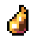

#  Gruhsha-CTF 

Мод для KAG, аналог европейских и американских Captains-модов, представляющий собой добавление капитанской системы и аккуратный ребаланс ванильного CTF-режима в сторону сплочённой игры командами, без использования каких-либо устоявшихся имбалансных мет.

Имеет следующие фичи:
- Капитанская система - два игрока выбираются капитанами команд (кто капитан, можно увидеть в таблице игроков) и формируют собственные команды из наблюдателей;
- Аккуратный ребаланс CTF-режима - никаких глобальных переделок в сторону стратегии (US Captains) или же изменения смысла режима (EU Captains), мы сохраняем ванильную основу настолько, насколько это возможно;
- Собственная система биндингов к определённым фичам мода;
- Система меток, позволяющая указать команде на определённое место;
- Фиксы самых мозговыносящих багов для улучшения качества геймплея;
- И многое другое, узнать подробнее можно в CHANGES.md!

## Установка
Создать папку ctf_gruhsha_v2 в Mods (King Arthur's Gold/Mods), скопировать файлы из репозитория туда и в mods.cfg вписать название мода (ctf_gruhsha_v2).

## Авторы
- Skemonde - создатель Груши
- TerminalHash - основной майнтайнер мода

#### Программисты:
TerminalHash, kussakaa, egor0928931, Vagrament aka FeeRant, Skemonde

#### Художники:
TerminalHash, kussakaa, Skemonde

## Большое спасибо:
Bunnie - с её разрешения были взяты некоторые изменения из VanillaNoRequiem и EU Captains;
mehwaffle - некоторые изменения были взяты из US Captains.

